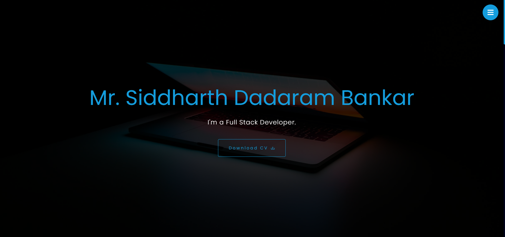

<div align="center">
	<h1> My Portfolio </h1>
</div>

## Snapshot 📸



## Tech Stack ✨

- [React.js](https://reactjs.org/) - UI Library
- [Framer Motion](https://www.framer.com/motion/) - Animations
- [Create React App](https://create-react-app.dev/) - Build tool

## How to run locally 💻

Follow these steps to run My Portfolio in your local machine.

### Clone this repository

```bash
git clone https://github.com/siddharthbankar12/portfolio
```

### Navigate to directory

```bash
cd my-portfolio
```

### Install NPM

```bash
npm install
```

### Run

Run the development server to view the app.

```bash
npm start
```

Now, you can navigate to http://localhost:3000/ to view the app.

### Build

```bash
npm run build
```

## Credits ✍

Implementation by [@siddharthbankar12](https://github.com/siddharthbankar12)
