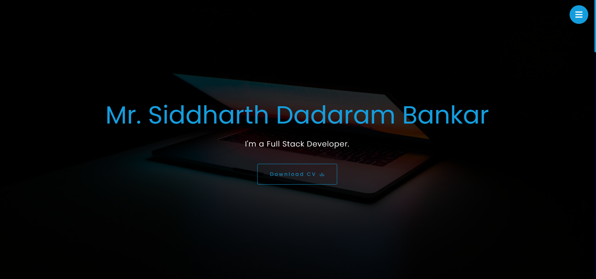

<div align="center">
	<h1> My Portfolio </h1>
</div>

## Snapshot 📸



https://siddharthbankar12.github.io/portfolio/

## Tech Stack ✨

- [React.js](https://reactjs.org/) - UI Library
- [Framer Motion](https://www.framer.com/motion/) - Animations
- [Create React App](https://create-react-app.dev/) - Build tool

## How to run locally 💻

Follow these steps to run My Portfolio in your local machine.

### Clone this repository

```bash
git clone https://github.com/siddharthbankar12/portfolio
```

### Navigate to directory

```bash
cd my-portfolio
```

### Install NPM

```bash
npm install
```

### Run

Run the development server to view the app.

```bash
npm start
```

Now, you can navigate to http://localhost:3000/ to view the app.

### Build

```bash
npm run build
```

### Deployment

```bash
npm run deploy
```

## Backend API

The backend tracks visitors and provides a counter. It's deployed separately:

- **Frontend**: GitHub Pages (this repo)
- **Backend**: Render.com ([deployment guide](backend/DEPLOYMENT.md))

API endpoints:

- `POST /api/track-visit` - Track a page visit
- `GET /api/visitor-count` - Get total unique visitors

## Credits ✍

Implementation by [@siddharthbankar12](https://github.com/siddharthbankar12)
